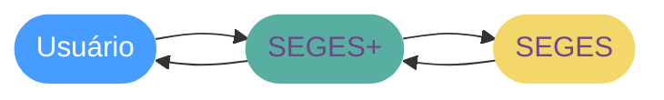

  
  <h1>SEGES+</h1>

## O que é o SEGES?

O _Sistema Estadual de Gestão Escolar_, conhecido como SEGES, é uma plataforma fornecida pela _Secretaria de Educação_. O serviço é utilizado por professores, pais e estudantes para consultas do boletim eletrônico, chamada escolar, rematrícula, etc. No entanto, devido à sua interface antiga e desatualizada, alguns usuários enfrentam dificuldades e insatisfações ao utilizá-lo. Pensando neste problema, desenvolvi o SEGES+, um aplicativo para Android que permite a consulta do boletim eletrônico de forma mais simples e fácil.

> [!WARNING]
> O SEGES+ não está relacionado ao SEGES e não é desenvolvido pela Secretaria de Educação.

## Como funciona?

Resumidamente, o aplicativo se comunica e realiza `web scraping`[^1] dos dados do usuário no site do SEGES e com isso disponibiliza uma interface aprimorada para o usuário.

### Ploblemas desta abordagem

> [!WARNING]
> Dado que a única forma de obter dados do SEGES atualmente é por meio de web scrapping, o aplicativo pode parar de funcionar a qualquer momento, uma vez que qualquer alteração no SEGES pode causar problemas ao aplicativo: **O SEGES+ é totalmente dependente do SEGES**.

### Limitações

O principal obstáculo para o projeto sem dúvidas é o `CORS` _(Cross-Origin Resource Sharing)_. Como o SEGES não expõe um cabeçalho permitindo o compartilhamento de recursos com outra origem[^2], é totalmente inviável utilizar soluções, como proxys, para permitir o desenvolvimento de uma versão web da aplicação.

Sendo assim, a solução é desenvolver um app nativo e utilizar a [Capacitor HTTP API](https://capacitorjs.com/docs/apis/http/), Ela corrige e aplica patches no `fetch` e no `XMLHttpRequest` para usarem as bibliotecas nativas do sistema, _seria como acessar o website oficial diretamente pelo navegador_. Porém esta solução não se aplica a web, apenas dispositivos nativos (iOS/Android).[^3]

## Instalação

> [!CAUTION]
> Esteja ciente de que a aplicação pode deixar de funcionar a qualquer momento. Não me responsabilizo por possíveis problemas, banimentos ou restrições causadas pela aplicação.

Você pode baixar o `APK` mais recente do SEGES+ clicando no botão abaixo:

No momento, o SEGES+ está disponível para download através das [releases do GitHub](https://github.com/Lobooooooo14/SEGES-plus/releases).

[^1]: https://pt.wikipedia.org/wiki/Coleta_de_dados_web
[^2]: https://developer.mozilla.org/pt-BR/docs/Web/HTTP/CORS
[^3]: https://ionicframework.com/docs/troubleshooting/cors#1-native-only-apps-iosandroid
